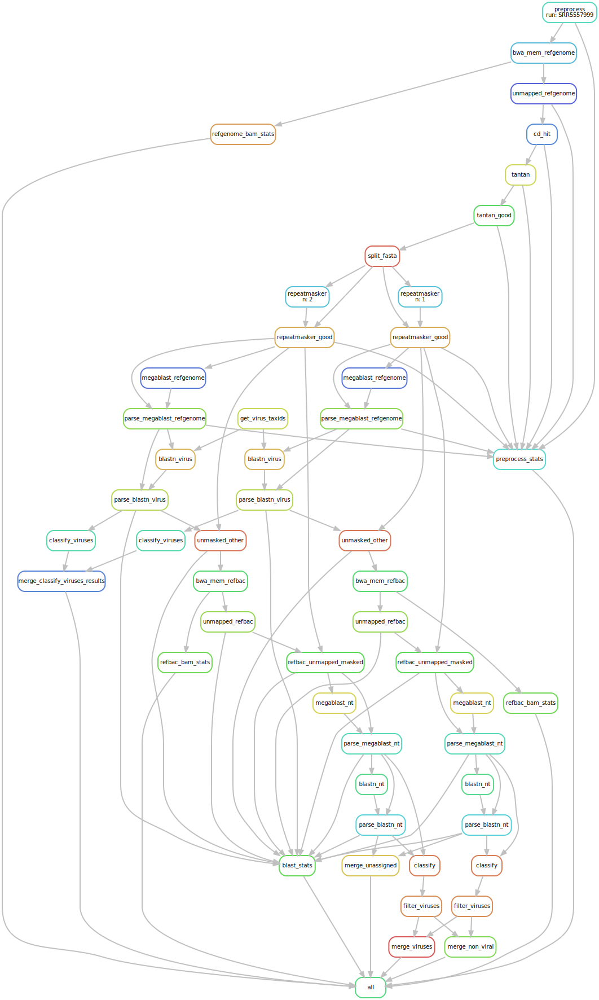

[](https://doi.org/10.5281/zenodo.3697729)

Snakemake implementation of [VirusSeeker Virome workflow](https://www.ncbi.nlm.nih.gov/pmc/articles/PMC5326578/). 

# Setup environment and install prerequisites

## Install miniconda

Download and install miniconda https://conda.io/docs/user-guide/install/index.html.
In case of Linux, following should work:
```
wget https://repo.continuum.io/miniconda/Miniconda3-latest-Linux-x86_64.sh
bash Miniconda3-latest-Linux-x86_64.sh
```

## Install environment

Create conda environment with **snakemake**. 
There are two options:

1. If you want to upload your results to [Zenodo](zenodo.org), then you need snakemake Zenodo remote provider, which is currently implemented in *zenodo-simple* branch in my forked snakemake repo. 

First, clone snakemake repo and checkout *zenodo-simple* branch:
```
git clone https://tpall@bitbucket.org/tpall/snakemake.git
cd snakemake
git checkout zenodo-simple
```

Then, create conda environment, install prerequisites and snakemake:
```
conda env create -f environment.yml -n snakemake
source activate snakemake
pip install -e .
```

2. Alternatively, if you don't want to upload your results to Zenodo, you can create conda environment and install snakemake 'normally': 
```
conda create -n snakemake -c bioconda -c conda-forge snakemake
source activate snakemake
```


### Clone this repo and cd to repo
(Change URL accordingly if using HTTPS)

```
git clone git@github.com:avilab/quantify-virome.git
cd quantify-virome
```

## Example

### Dry run

```
snakemake -n
```

### Create workflow graph

```
snakemake -d .test --dag | dot -Tsvg > graph/dag.svg
```

### Run workflow

This workflow is designed to be run in cluster. `cluster.json` configuration file may need some customisation, for example partition name. Memory nad maximum runtime limits are optimised for 100 splits. Number of splits can be specified in `config.yaml` file with n_files option (currently n_files is 2). Installation of software dependencies is taken care by conda, hence there is software installation overhead when you run this workflow for the first time in new environment. 

Example workflow submission script for slurm cluster, where values for job name, cluster partition name, time and memory constraints, and slurm log path (output) are taken from cluster.json: 
```
snakemake -j --use-conda --cluster-config cluster.json  \
             --cluster "sbatch -J {cluster.name} \
             -p {cluster.partition} \
             -t {cluster.time} \
             --mem {cluster.mem} \
             --output {cluster.output}"
```

You may want to use also following flags when running this workflow in cluster:
```
--max-jobs-per-second 1 --max-status-checks-per-second 10 --rerun-incomplete --keep-going
```

All other possible [snakemake execution](https://snakemake.readthedocs.io/en/stable/executable.html) options can be printed by calling `snakemake -h`.

## Exit/deactivate environment

Conda environment can be closed with the following command when work is finished:
```
source deactivate
```

## Workflow graph
For technical reasons, workflow is split into two parts, virome and taxonomy, that can be run separately, but taxonomy depends on the output of virome. Virome subworkflow (virome.snakefile) munges, masks, and blasts input sequences. Taxonomy subworkflow (Snakefile) merges blast results with taxonomy data and generates report.



Figure 1. **Virome workflow** graph with test sample split into two (default = 20) subfiles for parallel processing. Outputs parsed BLAST results.

